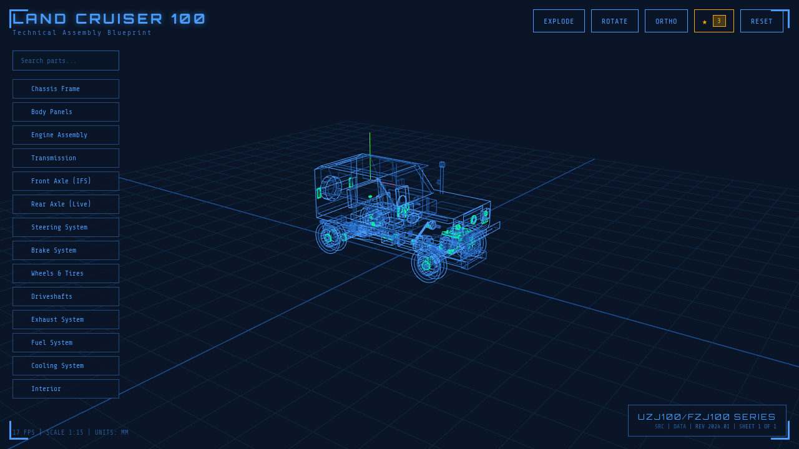

# Toyota Land Cruiser 100 Series - Interactive 3D Parts Catalog



An interactive 3D technical blueprint and parts catalog for the Toyota Land Cruiser 100 Series (1998-2007). Browse 2000+ genuine parts with exploded diagrams, search functionality, and direct links to purchase.

**Live Demo:** [https://landcruiser-spares.exe.xyz:8001/](https://landcruiser-spares.exe.xyz:8001/)

## Features

- 🚙 **Interactive 3D Model** - Rotate, zoom, and explore the Land Cruiser 100 in a blueprint-style visualization
- 🔍 **Part Search** - Search through 2000+ parts by name, part number, or category
- 📦 **Exploded Views** - Toggle exploded diagrams to see how components fit together
- 🛒 **Buy Links** - Direct links to purchase parts from Toyota EPC and Japan Parts suppliers
- 📋 **Part Details** - View part numbers, descriptions, quantities, and compatibility info
- 🎯 **Category Filtering** - Filter by Engine, Transmission, Suspension, Body, Electrical, and more
- 📱 **Responsive Design** - Works on desktop and mobile devices
- 🔒 **Privacy-Friendly** - Uses Bunny Fonts instead of Google Fonts for GDPR compliance

## Supported Models

- **UZJ100** - 2UZ-FE V8 4.7L (1998-2007)
- **FZJ100** - 1FZ-FE I6 4.5L (1998-2007)
- Land Cruiser 100 / Lexus LX470

## Quick Start

### Option 1: Static File Server (Simple)

Serve the files with any static file server:

```bash
# Using Python
python3 -m http.server 8001

# Using Node.js
npx serve -p 8001

# Using PHP
php -S localhost:8001
```

Then open http://localhost:8001 in your browser.

### Option 2: Go Server (With Visit Counter)

The included Go server provides a visitor counter API:

```bash
# Build and run
go build -o server server.go
./server
```

Server runs on port 8001 by default.

### Option 3: Docker

```bash
docker build -t lc100-catalog .
docker run -p 8001:8001 lc100-catalog
```

## Installation

### Prerequisites

- Go 1.19+ (for the server with visit counter)
- Node.js 16+ (optional, for regenerating part geometries)

### Clone and Run

```bash
# Clone the repository
git clone https://github.com/raffopenssh/landcruiser-100-3d.git
cd landcruiser-100-3d

# Build the Go server
go build -o server server.go

# Run
./server
```

### Systemd Service (Production)

For production deployment on Linux:

```bash
# Copy the service file
sudo cp lc100.service /etc/systemd/system/

# Edit paths if needed
sudo nano /etc/systemd/system/lc100.service

# Enable and start
sudo systemctl daemon-reload
sudo systemctl enable lc100.service
sudo systemctl start lc100.service

# Check status
sudo systemctl status lc100.service
```

## Project Structure

```
landcruiser-100-3d/
├── index.html              # Main application (HTML/CSS/JS)
├── app.js                  # Three.js 3D visualization engine
├── server.go               # Go HTTP server with visit counter
├── parts-data.js           # Parts database (2000+ parts)
├── parts-geometry.json     # 3D wireframe geometries for parts
├── parts-geometry.min.json # Minified geometries
├── buy-links.json          # Purchase links for parts
├── og-image.png            # Social media preview image
├── robots.txt              # Search engine directives
├── sitemap.xml             # Search engine sitemap
├── lc100.service           # Systemd service file
├── tools/                  # Development utilities
│   ├── generate-part-geometries.js
│   └── split-geometries-by-category.js
└── geometry/               # Per-category geometry files
```

## Configuration

### Changing the Port

Edit `server.go` and change the port number:

```go
http.ListenAndServe(":8001", nil)  // Change 8001 to your preferred port
```

Or use a reverse proxy (nginx, Caddy) to serve on port 80/443.

### Customizing Parts Data

Parts data is stored in `parts-data.js`. The format is:

```javascript
const PARTS_DATABASE = {
  "engine": [
    {
      "partNumber": "12345-67890",
      "name": "OIL PUMP ASSEMBLY",
      "description": "Oil pump for 2UZ-FE engine",
      "quantity": 1,
      "category": "engine"
    },
    // ...
  ],
  // ...
};
```

## API Endpoints

The Go server provides these endpoints:

| Endpoint | Method | Description |
|----------|--------|-------------|
| `/` | GET | Serves the main application |
| `/api/visit` | GET | Increments and returns visitor count |
| `/api/count` | GET | Returns current visitor count |

## Development

### Regenerating Part Geometries

If you modify the parts database, regenerate the 3D geometries:

```bash
cd tools
node generate-part-geometries.js
```

See `tools/README.md` for more options.

### Building the Server

```bash
# Development
go run server.go

# Production build
go build -ldflags="-s -w" -o server server.go
```

## Browser Support

- Chrome 80+
- Firefox 75+
- Safari 13+
- Edge 80+

Requires WebGL support for 3D rendering.

## Privacy

This application:
- ✅ Uses Bunny Fonts (GDPR-compliant) instead of Google Fonts
- ✅ No external tracking or analytics
- ✅ No cookies required for core functionality
- ✅ Visit counter is stored locally on the server

## License

MIT License - See [LICENSE](LICENSE) for details.

## Credits

- 3D visualization powered by [Three.js](https://threejs.org/)
- Fonts from [Bunny Fonts](https://fonts.bunny.net/) (Orbitron, Share Tech Mono)
- Parts data sourced from Toyota EPC

## Contributing

Contributions are welcome! Please:

1. Fork the repository
2. Create a feature branch (`git checkout -b feature/amazing-feature`)
3. Commit your changes (`git commit -m 'Add amazing feature'`)
4. Push to the branch (`git push origin feature/amazing-feature`)
5. Open a Pull Request

## Support

- 🐛 [Report bugs](https://github.com/raffopenssh/landcruiser-100-3d/issues)
- 💡 [Request features](https://github.com/raffopenssh/landcruiser-100-3d/issues)
- ⭐ Star this repo if you find it useful!
